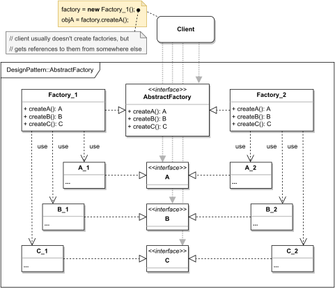

# ABSTRACT FACTORY

#### GENERAL

**Creational** GoF design pattern that allows us to create variations of related objects without the
need for static definitions of exact types.

#### USAGE

It's mainly used as a way to restrict usage of only one variant at any give time, while also preserving
the flexibility of specifying which one during runtime.

#### STRUCTURE

TL;DR behaviour - there is a set of related objects (**A, B, C**) with different variations (**A_1|A_2, B_1|B_2, C_1|C_2**)
and instead of instantiating them directly, client has access only to factories (**Factory_1, Factory_2**) that do the 
instantiation for him. Each of these factories is then responsible for creating only one of the variants and because
they all follow the same interface (**AbstractFactory**), they're arbitrarily interchangeable.

#### EXAMPLE

Let's imagine following situation in the context of aforementioned [prototype](../README.md#prototype). The **modeler**
which is responsible for final calculations can work with different statistical models that all use the same set of
variables. Furthermore, the **modeler** has to support data binning (sorting data into virtual "bins") using varying 
approaches. Also, there has to be a way to ensure that one computation won't mix different binning principles.

#### SOLUTION

One way to meet the set criteria is to use an **Abstract Factory**. If we think about it, the set of variables used by
statistical models is equal to the set of related objects and the different binning approaches can be different 
variations of the variables (i.e. related objects). 

Dummy implementation of this [example/solution](src) and [how to use it](main.cpp) is part of this directory.

#### SUMMARY

Best thing about this solution is that it indirectly restricts variable creation to only one variation at a time.
Also adding new variations (i.e. binning principles) won't require that much effort, because all that's needed is
adding corresponding objects and factory.

Probably the biggest disadvantage is that opposed to adding new binning approaches, adding whole new variable will 
require some extra work - extending the factories' interface (**AbstracFactory**) and therefore extending all 
existing factories.
