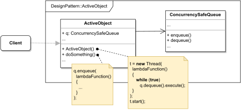

# ACTIVE OBJECT

#### GENERAL

**Concurrent** design pattern that introduces concurrency through asynchronous method invocation which is achieved by
decoupling it from method execution (i.e. we register method was called, but don't execute it immediately).

#### USAGE

Generally this pattern can be used for any objects that can reside in their own thread of control and will benefit
from executing some behaviour concurrently for better performance.

#### STRUCTURE

TL;DR behaviour - there is a main object (**ActiveObject**) that upon its initialization creates its own thread which
is then used to execute individual tasks. The decoupling of method invocation/execution is done via concurrency safe
collection (**ConcurrencySafeQueue**). Idea is that when client calls one of active object's methods the essence of
this call (i.e. method invocation) is captured through storing something in the **ConcurrencySafeQueue** (can even be
lambda expression) which is than used by the internal worker thread as a "notification mechanism" that a new task is
ready to be executed.

NOTE: entities in mentioned form actually encapsulate several responsibilities at once - more generic although less
common approach uses six elements: client's interface, task representation, task list, scheduler, task logic implementation
and a callback. [In-depth explanation of individual elements](https://www.dre.vanderbilt.edu/~schmidt/PDF/Active-Objects.pdf)

#### EXAMPLE

Let's imagine following situation in the context of aforementioned [prototype](../README.md#prototype). The **scraper**
which is responsible for acquiring data from the web (i.e. running several web crawlers) should probably run these
crawlers concurrently otherwise it'd be pretty much unusable nowadays 'cause of bad performance.

#### SOLUTION

A nice way to implement this is to make individual crawlers **Active Objects**. We just have to create our own thread
safe queue used for registering/executing crawling tasks and then make it so crawlers create their own worker thread
with their own initialization. The worker thread will then try to continually read from the task queue and execute 
any incoming tasks, while the crawler's methods that are publicly accessible will just add new tasks to the queue.

Dummy implementation of this [example/solution](src) and [how to use it](main.cpp) is part of this directory.

#### SUMMARY

This pattern brings several advantages such as improved performance or parallelism without the need for any additional
synchronization, at the expense of only typical drawbacks associated with concurrency such as higher complexity and
more difficult debugging.
