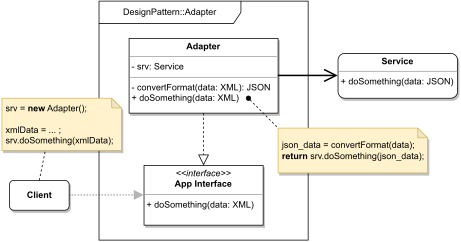

# ADAPTER

#### GENERAL

**Structural** GoF design pattern that translates communication between objects with incompatible interfaces in
such way so that they can seamlessly work together (i.e. there is no need to modify neither of the original objects).

#### USAGE

This pattern is greatly used in situations when we don't have any control over the objects with incompatible interfaces and
therefore cannot make needed changes directly in them (e.g. third-party libraries). Also, it's quite common in elderly
applications that grew over the years and changes in their interfaces would cause more harm than good.

#### STRUCTURE

TL;DR behaviour - there are two sides that want to cooperate in some way (**Client** and **Service**) but can't do so
directly, because they have incompatible interfaces. Main actor in the solution is the **Adapter** which basically just
copies the interface one side can use (i.e. **Client**) and re-implements its methods, so they do whatever necessary
transformations into the interface of the other side (i.e. **Service**) that it then invokes.

#### EXAMPLE

Let's imagine following situation in the context of aforementioned [prototype](../README.md#prototype). The **scraper**
which is responsible for acquiring data from the web (i.e. running several web crawlers), uses some third-party library
for the actual web crawling, but unfortunately a huge security flaw has been discovered within this library and so it's
gotta be replaced with a different one ASAP. Now the biggest problem is that the original library is kinda hard-coded 
into the **scraper** and the new library exposes slightly different interfaces.

#### SOLUTION

One way to solve the problem that arose is to use an **Adapter**. The solution requires just creating a new class that
will have the exact same interface as the old library, but under the hood it'll reference the new library and 
re-implement all methods in a suitable manner.

Dummy implementation of this [example/solution](src) and [how to use it](main.cpp) is part of this directory.

#### SUMMARY

Exploiting this pattern can be tricky - there are situations where it might just be the best option as well as the exact
opposite. In the given example it's somewhat 50/50, best described as a "quick and dirty" solution. Given the urgency
using **adapter** is extremely fast and simple, but in the long run, it would be much cleaner to just modify the
existing **scraper** code to work with the new library (or be more generic).
