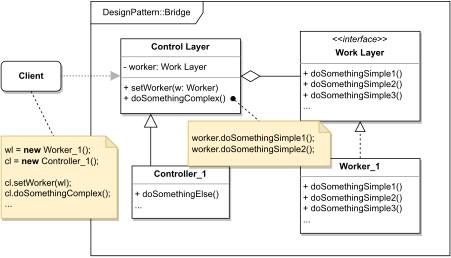

# BRIDGE

#### GENERAL

**Structural** GoF design pattern that tells us how to split a set of closely related classes (or one giant class) into
two separate hierarchies which can be then developed absolutely independent of each other.

#### USAGE

Generally this pattern can be useful in cases when we have some "control entity" that should be able to work with
several types of platforms it relies on (i.e. cross-platform apps, multiple API providers, ...).

#### STRUCTURE

TL;DR behaviour - the structure is split into two separate hierarchies: control layer (a.k.a. abstraction) and work layer
(a.k.a. implementation). The work layer (**WorkLayer, Worker_1, Worker_2, ...**) implements concrete variations of some
behaviour and the control layer (**ControlLayer, Controller_1, ...**) then wraps one concrete worker which it uses
to do some work. Usually workers implement very atomic-ish operations and controllers put several of them together
to perform more complex actions.

Thanks to this design controllers can use any individual workers and developments in either of these two layer won't 
affect the other layer in any way.

#### EXAMPLE

Let's imagine following situation in the context of aforementioned [prototype](../README.md#prototype). The **req. handler**
saves processed requests in database for caching purposes (calculated score is valid for certain amount of time).
This DB is provided by another dept. responsible for all DBs hosted on company's internal server and because the company
constantly changes the technologies it uses, we want to separate the DB specific code from the caching logic, so we can
easily accommodate possible use of different types of databases (e.g. Oracle, Postgres, MySQL, ...) in the future. 

#### SOLUTION

One way to design our example is with the use of a **Bridge**. The solution consist of two hierarchies: one that provides
DB specific code (i.e. connection, selects, inserts, ...) and second which provides the caching details and then uses
concrete implementation of the first one (based on currently used type of DB) to store the results.

Dummy implementation of this [example/solution](src) and [how to use it](main.cpp) is part of this directory.

#### SUMMARY

Biggest drawback of this pattern is that at first sight it's kinda complicated and not really intuitive, but it has
its advantages, especially in the long run because it's extremely flexible towards future changes. It also gives us
the option to swap individual workers at runtime.
