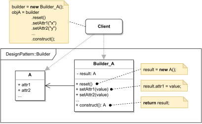

# BUILDER

#### GENERAL

**Creational** GoF design pattern that allows us to build complex objects step by step and further control the 
construction process.

#### USAGE

It's mainly used as a simplification (gets rid of "telescoping constructor") when creating multiple representations 
of an object or when the construction process has to follow some additional "non-standard" rules.

#### STRUCTURE

TL;DR behaviour - there is a complex object (**A**) that won't be instantiated directly but through its builder
(**Builder_A**). The builder has its own private copy of the object its building and defines chainable methods 
for setting the object's individual attributes. These methods can also implement additional restrictions/conditions.

NOTE: displayed version is builder's most simplified form - there is also slightly extended version which puts a
so-called **director** between the client and the builder that is then used for ease of creation of reoccurring 
object instances (basically predefines a certain configurations of created objects).

#### EXAMPLE

Let's imagine following situation in the context of the aforementioned [prototype](../README.md#prototype). The **scraper**
which is responsible for retrieving client's information from the web will have a dataclass for storing individual
properties. Now because it'll be a somewhat large entity and the **scraper** would probably run several web crawlers 
in parallel, it would be nice if the construction of the data profile could work in mutually exclusive steps and also
assured that after its construction it won't be easily tampered with.

#### SOLUTION

One way to meet the set criteria is to use a **Builder**. Getter/setter approach isn't really viable as that would
allow tampering with attributes after object creation. It could kinda be solved using multiple constructors, but this
approach would pretty much require new constructor for each attribute of the dataclass (telescoping constructor problem).
So in the end the easiest and cleanest solution is to create a builder for the data profile class that will be 
responsible for setting individual attributes and construction the finalized object.

Dummy implementation of this [example/solution](src) and [how to use it](main.cpp) is part of this directory.

#### SUMMARY

There isn't really much to discuss in regard to the example and solution using **Builder** pattern as it does exactly
what's required at the cost of only adding one class (possibly few more if we wanted to make more generic solution).
