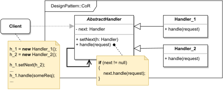

# CHAIN OF RESPONSIBILITY (CoR)

#### GENERAL

**Behavioral** GoF design pattern that lets us process requests using chain of handlers in which individual links either
do something or just pass the request to next in line.

#### USAGE

Mainly used in situations when request can be processed by sequential steps, and it's desired to handle different types
of requests in different ways. **CoR** then allows dynamically defining chains using already existing handlers.

#### STRUCTURE

TL;DR behaviour - main idea is that individual handlers (**Handler_1, Handler_2, ...**) mimic a list collection (i.e. 
each handler can store a reference to different handler and so on - together forming a chain). Next each handler
implements handling method which either does something with the request (it can even drop the request midway) or 
just passes it along until it reaches the last link.

#### EXAMPLE

Let's imagine following situation in the context of aforementioned [prototype](../README.md#prototype). The **request handler**
which is responsible for processing incoming requests has to execute multiple steps like authorization of a caller 
system, search for cached results and so on. We'd also like to implement the handling process in such a way that'll
be ready to accommodate various request types in the future.

#### SOLUTION

One way to meet the set criteria is to use a **Chain of Responsibility**. We essentially just implement a number of handlers
for distinct steps before instantiating the main chain through which all incoming requests will be processed.

Dummy implementation of this [example/solution](src) and [how to use it](main.cpp) is part of this directory.

#### SUMMARY

Best aspect of this strategy is that thanks to its modularity it's incredibly adaptable to potential extensions. Beyond
that it also allows runtime modifications to the handling process.

Key issue to watch out for is that incautious implementations main lead to unhandled requests as there is no default
which would handle all unmatched cases.
