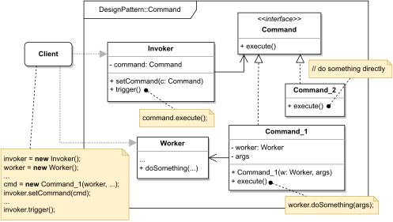

# COMMAND

#### GENERAL

**Behavioral** GoF design pattern that lets us represent requests as stand-alone objects, so they can be stored, passed
as function/method arguments, queued and more.

#### USAGE

This pattern is frequently used in situations when it's required to physically represent some requests. One of more 
common cases being task scheduling/queueing.

#### STRUCTURE

TL;DR behaviour - most crucial components are individual **commands** (**Command_1, Command__2**) which can be of two
types, either command that directly does some work (**Command_2**; less common) or command that just invokes some worker
object (**Command_1**; more common). Besides these commands there are usually two more important entities - the **invoker**,
which generates commands in response to certain events and the **worker**, whose logic is triggered by some commands.
**Client** that just instantiates all mentioned parties and binds them together as need.

#### EXAMPLE

Let's imagine following situation in the context of aforementioned [prototype](../README.md#prototype). The **scraper**
which is responsible for acquiring data from the web (i.e. running several web crawlers) should be able to queue received
scraping requests, so they can be gradually processed by available crawlers. The crawlers support various crawling modes
(shallow, deep, ...) and also we'd like to store the requests, so they can be picked up in case of a crash.

#### SOLUTION

One way to meet the set criteria is to use a **Command** pattern. Implementation is pretty straightforward and requires
just creating command classes that'll wrap all necessary parameters and have execution method which'll just invoke
corresponding crawlers' methods.

Dummy implementation of this [example/solution](src) and [how to use it](main.cpp) is part of this directory.

#### SUMMARY

There aren't really any downsides to using commands besides code inflation which is easily outweigh by all of its
capabilities. As mentioned they can be used for postponing the execution process. Another hardly achievable functionality
they excel at is implementing "undo/redo" operations. Bottom line, if you find yourself in situation where it makes
sense to represent some actions as standalone objects, then by all means go for it.
