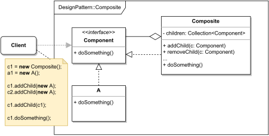

# COMPOSITE

#### GENERAL

**Structural** GoF design pattern that tell us how to define tree-like structures whose individual elements act
as standalone objects (i.e. in terms of usability there is no distinction between inner nodes and leaf nodes).

#### USAGE

Most commonly this pattern is used to represent GUI elements in applications. Generally though you can use it in any
situation where you have tree-like object structures (i.e. objects that can contain collection of themselves) and/or
want such objects to have uniform interface.

#### STRUCTURE

TL;DR behaviour - there is a common interface (**Component**) for "end objects" (**A**) as well as inner objects (**Composite**)
which contain a collection of child objects. Thanks to the shared interface the **Composite** objects can have amongst
its children another **Composite** objects, so theoretically they can nest forever (not really 'cause of HW limitations).
The **Composite** object than usually just delegates the work ( **doSomething()** ) to all of its children and accumulates
their results into one.

#### EXAMPLE

Let's imagine following situation in the context of aforementioned [prototype](../README.md#prototype). The **transformer**
and **modeler** work with our own DataProfile structure which we use to store the transformed scraped client's data. 
This structure can have several levels of nested sections and as an "end objects" stuff like client's id, ratings, etc.
For ease of use we'd like all elements of this structure should allow for common functionality (e.g. count of existing
non-empty values).

#### SOLUTION

Because of the essence of DataProfile (i.e. nesting sections with sections/"end objects") we can neatly take advantage
of the **Composite** pattern. We basically just define common interface and in the implementation for DataProfileSections
create a collection of children objects as well as make methods invoke corresponding methods on all children.

Dummy implementation of this [example/solution](src) and [how to use it](main.cpp) is part of this directory.

#### SUMMARY

Main obstacle that might be hard to overcome is defining just the right amount in the common interface, because there
can be a wide variety of "end objects" whose functionality might differ a lot.
