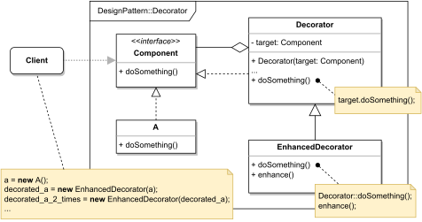

# DECORATOR

#### GENERAL

**Structural** GoF design pattern that allows us to extend object's behaviour by placing him into a dedicated wrapper
that provides new functionality.

#### USAGE

It's mainly used when you want to dynamically modify/combine various behaviours during runtime. It can also be used
to extend classes with "final" methods that prevent extension through inheritance.

#### STRUCTURE

TL;DR behaviour - there is a base object (**A**) that does something, whose behaviour we want to enhance. This enhancement
is done through **decorators** that basically just wrap around an object and re-implement the "work methods" to do something
extra as well as call the original method of the wrapped object. And because the base objects (**A**) and **decorators**
follow same interface, they can actually wrap already wrapped objects (i.e. you can stack them).

#### EXAMPLE

Let's imagine following situation in the context of aforementioned [prototype](../README.md#prototype). The **scraper**
which is responsible for acquiring data from the web (i.e. running several web crawlers) implements its own base crawler
that just downloads the targeted website. Now because we know that some webpages we scrape take ages to download, some
are frequently unavailable and so on, we want to have a way for dynamic behaviour enhancements of the base crawler.
For example one crawler should support timeouts, another one retry policy, another retries with timeouts...

#### SOLUTION

One way to meet the set criteria is to use a **Decorator**. The solution is quite cunning, we just create shared interface
for the base crawler and all the decorators. Then we just implement for example timeout decorator which will provide
functionality of timeouts and to use it we will just wrap the base crawler in it. We can do the same with retry decorator,
encrypt decorator, log decorator and others. Finally individual decorators can be combined at will to create any variation
we could ever possibly need.

Dummy implementation of this [example/solution](src) and [how to use it](main.cpp) is part of this directory.

#### SUMMARY

Huge advantage of this pattern is that it's extremely flexible thanks to its modularity and any future extensions are
extremely simple as they will require just the creation of corresponding decorator.

On the other hand the code might be a bit confusing and ugly (especially the initial setup part). Also, decorator stacking
requires certain prudence since the order in which they are applied matters and therefor can produce varying results.
