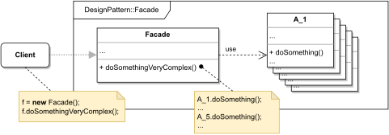

# FACADE

#### GENERAL

**Structural** GoF design pattern that hides complex internals of libraries/frameworks behind simplified interface.

#### USAGE

Primarily used to simplify complex layouts, typically when some process calls for collaboration between numerous classes.

#### STRUCTURE

TL;DR behaviour - very straightforward, there is several cooperating classes (**A_1, A_2, ...**) which by themselves
are difficult to use. Normally the **client** would have to instantiate them and perform individual steps of some 
demanding task by hand which is highly inconvenient. To improve experience we can create a new class (**Facade**)
that'll do most of the client's work and just expose simplified interface.

#### EXAMPLE

Let's imagine following situation in the context of aforementioned [prototype](../README.md#prototype). We have immense
logging library that can do pretty much anything we could ever hope for, but nothing comes without a price. With that
said, the price in this case is that the library requires setting up several objects before it can be even used and 
even then it's kinda annoying to work with.

#### SOLUTION

One way to solve the inconvenience is to use a **Facade**. The solution is very simple, it pretty much just involves 
creating a new class that does the entire setup and exposes minimalistic interface to just log given string message.

Dummy implementation of this [example/solution](src) and [how to use it](main.cpp) is part of this directory.

#### SUMMARY

Not really much to discuss here - this pattern has simple motivation and a simple solution at the cost of only one
new class. Only thing to look out for is that the **Facade** can easily become a god object that is coupled to all 
underlying classes, which isn't really ideal.
