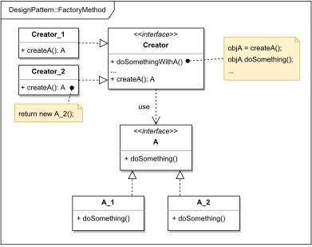

# FACTORY METHOD

#### GENERAL

**Creational** GoF design pattern that defines an interface for creating objects, but lets individual subclasses
decide which concrete object to instantiate.

#### USAGE

It's mainly used when there is an uncertainty in future development, and you don't know beforehand what concrete
objects have to be accommodated in the rest of the code.

#### STRUCTURE

TL;DR behaviour - there is an entity (**A**) with specific variations (**A_1, A_2**) that are most likely going
to be diversified during app's lifecycle. Furthermore, there is a factory (**Creator**) that somehow works with 
this entity and so it has to adapt to the future extensions. To do that, instead of hard-coding creation
of specific types, the factory (**Creator**) works with its own abstract method (**createA()** - i.e. Factory Method) 
which is then implemented in its subclasses (**Creator_1, Creator_2**) to return one of the concrete entity types
(**A_1, A_2**).

#### EXAMPLE

Let's imagine following situation in the context of the aforementioned [prototype](../README.md#prototype). To unify
the way we do logging in all components we want to code our own minimalistic logging library. Part of this library
will probably be some kind of main logger object. Now because requirements on our app constantly evolve we want the
logging library to be versatile and support storing logs to different destinations (e.g. console, file, ...) but
we don't really know the full list of possible storages.

#### SOLUTION

One way to meet the set criteria is to use a **Factory Method** for part of the logging library. Basically we just
separate the "writing logic" into its own class hierarchy that will mediate access to the underlying storage
(ConsoleStorage, FileStorage, ...). After that we'll just modify the main logger class, so it doesn't use concrete
storages, but in their place calls its own abstract method for creating the storage object. This method will then be
overridden in subclassing loggers according to used storing destination (e.g. ConsoleLogger, FileLogger, ...).

Dummy implementation of this [example/solution](src) and [how to use it](main.cpp) is part of this directory.

#### SUMMARY

Best part about this approach is that future extensions with new storage types are extremely simple - all that is
required is to implement the storage class (e.g. ElasticsearchStorage) and logger subclass (e.g. ElasticsearchLogger) 
that overrides the abstract factory method to create corresponding storage object.

Probably the biggest disadvantage is that this approach can be a little confusing at first and requires thorough
initial consideration of all the common interfaces.
