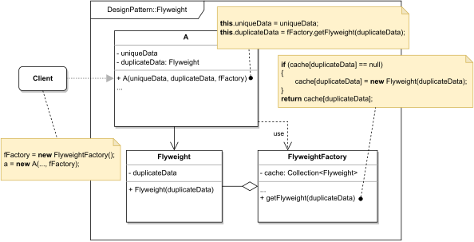

# FLYWEIGHT

#### GENERAL

**Structural** GoF design pattern that allows us to minimize memory usage by sharing common attributes
of multiple objects.

#### USAGE

This pattern is used in situations where an application contains huge number (thousands) of large objects
that take up far too much memory. It's not very frequent as its strengths show only in extreme cases.

#### STRUCTURE

TL;DR behaviour - there are data heavy objects (**A**) that have numerous copies. What's important is that these objects
frequently have the exact same portion of their attributes. So instead of each of them having their own copy, we can
extrapolate the common attributes to a separate class (**Flyweight**) whose instances are then just referenced in the
original objects (with this approach we can effectively shrink MBs of data into the size of a pointer). Last and 
very important part is the **FlyweightFactory** which is responsible for caching new **Flyweight** instances or 
returning an already existing ones.

#### EXAMPLE

Let's imagine following situation in the context of aforementioned [prototype](../README.md#prototype). The **scraper**
which is responsible for acquiring data from the web (i.e. running several web crawlers) grew into unimaginable dimension
and constantly creates hundreds of crawlers. It's gotten so bad that we had to increase the available memory a few times.
After examining the code we figured out that huge drain on resources is caused by each crawler having its own copy of
config values (e.g. timeout, retry count, proxy details, ...) even though these values are for the most part always
same.

#### SOLUTION

One way to reduce memory usage is to use a **Flyweight**. We just extrapolate the configuration values into their own
dataclass, create corresponding config factory and in the crawlers replace the config values with a reference to the
new dataclass which will be instantiated using the factory if needed be.

Dummy implementation of this [example/solution](src) and [how to use it](main.cpp) is part of this directory.

#### SUMMARY

Using the **flyweight** should be done with caution as it usually trades memory for CPU cycles (i.e. speed) and makes
the code harder to navigate/understand. 
