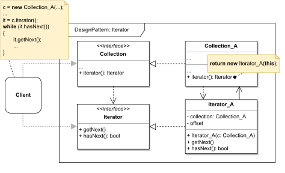

# ITERATOR

#### GENERAL

**Behavioral** GoF design pattern that allows us to traverse elements of a collection without the need
to expose its implementation details.

#### USAGE

**Iterators** are commonly used in combination with complex data structures as a way to simplify their
traversal. They can also be very useful when we need to store iteration state midway through traversal.

#### STRUCTURE

TL;DR behaviour - there is an intricate data structure (**Collection_A**) that can create associated
iterator (**Iterator_A**) which stores reference to the collection and current state. The **iterator**
then has methods for moving backwards/forwards which just modify its state, but never the actual collection.

NOTE: in generic implementation there are common interfaces, but in real life you won't typically define those
as they part of the majority of standard libraries in most programming languages.

#### EXAMPLE

Let's imagine following situation in the context of aforementioned [prototype](../README.md#prototype). The **transformer**
which is responsible for transforming scraped data into numerical values has its own dataclass for client's data profile
that is formed by sections of key/value items (i.e. basically map of maps). It then has to iterate through all the
values in several places in the code.

#### SOLUTION

To simplify the traversal of data profile and reduce duplicate code we can use an **Iterator**. Idea is very simple, we
just create associated class which stores attributes pointing at the actual data that are updated with each iteration.
Because our examples use C++ we will follow its standard practices so our **iterator** can be used almost in the exact
same way as existing iterators that are part of the std.

Dummy implementation of this [example/solution](src) and [how to use it](main.cpp) is part of this directory.

#### SUMMARY

Main advantage is that **iterators** put the iteration process in one place so if the traversal algorithm is more
complex (e.g. pre/in/post-order in BST) we don't have to keep re-implementing it. Also thanks to them being separate
objects we can have multiple **iterators** over the same collection, we can easily store them and even pause them.

Only downside to this pattern is that we can lose some performance a thanks to its complexity it's really only
useful for very complex data structures.
