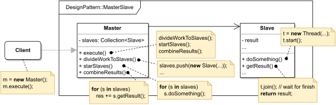

# MASTER/SLAVE

#### GENERAL

**Concurrent** design pattern that brings some order into multithreaded applications by introducing two entities - slaves
who carry out actual computations and a master whose main job is to manage working slaves and accumulate their results.

#### USAGE

This pattern can be applied to virtually any concurrent program whose primary function is to repeat the same operation 
only with different parameters. Usually it's used on larger scales that inside of a one app (e.g. server load balancing).
Microservice based applications can even have entire microservices act as a set of slaves.

#### STRUCTURE

TL;DR behaviour - there is a **Master** that exposes some public methods toward the client and upon their invocation
it delegates all the "heavy lifting" to **Slave** objects. **Slaves** perform specific micro tasks usually in their 
own threads to fully take advantage of modern multi-core CPUs. Lastly the **Master** waits for certain set of **slaves**
to finish their work and if needed combines their results before returning some value to the client.

#### EXAMPLE

Let's imagine following situation in the context of aforementioned [prototype](../README.md#prototype). The **scraper**
which is responsible for acquiring data from the web (i.e. running several web crawlers) should probably run these
crawlers concurrently. Besides triggering the exact same crawling only for different clients, the scraping process might
require some additional control (e.g. before crawling through client's website we have to acquire its URL from somewhere,
most likely by crawling through search engines like Google).

#### SOLUTION

There are countless ways to implement this kind of behaviour, but thanks to its essence one fairly clean approach is 
to use **Master/Slave** design. We can just make the crawler objects into **slaves** that will carry out most of the
workload (in their own threads) and then just have some sort of *ScraperCore* which will instantiate these crawlers 
as needed and dictate what they should do.

Dummy implementation of this [example/solution](src) and [how to use it](main.cpp) is part of this directory.

#### SUMMARY

**Master/Slave** is highly popular thanks to its efficiency and simplicity of principle. Most of the drawbacks once
again come from problems with concurrent programming which lie in more challenging implementation and debugging.
