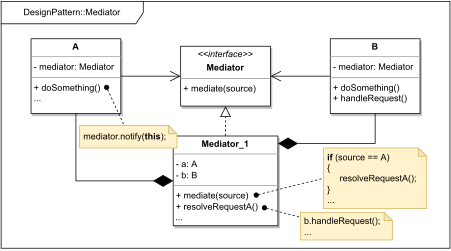

# MEDIATOR

#### GENERAL

**Behavioral** GoF design pattern that helps us to reduce coupling between objects by forcing them to 
communicate indirectly through an intermediary, thanks to which individual components are easier to modify.

#### USAGE

Most commonly used in communication between GUI components. However, generally it works best when we have a large 
number of classes that frequently communicate with one another.

#### STRUCTURE

TL;DR behaviour - there are classes that want to communicate with each other (**A, B, ...**) however that would require
them being cross-referenced (i.e. be tightly coupled). To avoid this we introduce new object to the ecosystem (**Mediator_1**)
which mediates the communication between individual objects (**A, B, ..**) so they can be dependant only him.

#### EXAMPLE

Let's imagine following situation in the context of aforementioned [prototype](../README.md#prototype). The **scraper**
which is responsible for acquiring data from the web (i.e. running several web crawlers) has to trigger some crawlers
before others, and they then need to communicate with each other as some of them need previously scraped data to do 
their own crawling (e.g. to scrape client's website we first have to acquire correct url from some other source like
google).

#### SOLUTION

One way to design the **scraper**, so it accommodates the mentioned situation is to use a **mediator**. Essentially so 
individual crawlers don't have to be cross-referenced, but still can trigger each other, we simply create an intermediary
object which will be in charge of receiving notifications from finished crawlers and subsequently triggering dependent ones.

Dummy implementation of this [example/solution](src) and [how to use it](main.cpp) is part of this directory.

#### SUMMARY

When using this design pattern, the only thing to watch out for is how easy the intermediary object might develop into
a "god object" that knows everything (they violate several principles of good OO design and therefor are considered
a code smell).