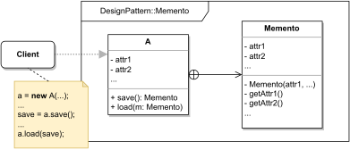

# MEMENTO

#### GENERAL

**Behavioral** GoF design pattern with one very simple intent - saving/restoring object's internal state without 
exposure of its internals.

#### USAGE

Not really much to go through here, this pattern is used when we have objects with mutable inner state, and we want
capture this state at certain point in time for possible future restoration.

#### STRUCTURE

TL;DR behaviour - there is an object (**A**) whose internal state is represented by its attributes (**attr1, attr2, ...**).
The save/restore functionality is then handled by two new methods (**save/load**) and a nested class (**Memento**) 
which acts as a private immutable storage for the internal state.

NOTE: there are other types of implementation for programming languages that don't support nested classes

NOTE: dynamic languages can't really guarantee immutability of snapshots

#### EXAMPLE

Let's imagine following situation in the context of aforementioned [prototype](../README.md#prototype). The **transformer**
which is responsible for transforming scraped data into numerical values has its own dataclass for client's data profile
that is formed by sections of key/value items (i.e. basically map of maps). Now for whatever reason we need to be able
to revert unwanted changes as the data profile is gradually built.

#### SOLUTION

One fairly neat way to accommodate the mentioned criteria is to use a **Memento**. We just extend the data profile class
with a nested class which will copy same attributes and add two new functions for creating/loading snapshots.

Dummy implementation of this [example/solution](src) and [how to use it](main.cpp) is part of this directory.

#### SUMMARY

Although this pattern is fairly simply there is a lot to watch out for - if **mementos** are created very often it'll
put high strain on app's memory usage, also the caretaker of mementos (i.e. client) should be able to track lifecycles
of underlying objects, so it doesn't store unnecessary snapshots.
