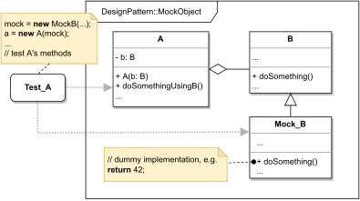

# MOCK OBJECT

#### GENERAL

**Structural** design pattern that focuses on breaking up dependencies and in that making objects more easily testable.

#### USAGE

Mocks are extremely common and pretty much necessary in unit testing. Frameworks use them to break tightly coupled
objects, so they can be tested by themselves without any parasitic behaviour.

#### STRUCTURE

TL;DR behaviour - mock subclasses an object (**B**) upon which different object (**A**) is dependent. To test the latter
we have to instantiate it which requires the former, but we do not want any potential bugs of **B** to dilute results
of **A**'s tests. To prevent this we create **mock object** (**Mock_B**) which subclasses **B** and re-implements it's
methods to be logically equal but as simple as possible.

#### EXAMPLE

Let's imagine following situation in the context of the aforementioned [prototype](../README.md#prototype). We have a
logger class used for logging which internally uses storage class to write the logs into a certain destination. And
as good developers we should write unit tests for every line of this code.

#### SOLUTION

Best way to unittest the logger class is to use **Mock Object** for the storage class upon it depends. Basically we just
create new class which subclass the storage's interface and implements its methods in the simplest form (i.e. it'll just
simulate storing logs in-memory, for example in a simple variable or a list). After that when we instantiate logger class
for testing we just pass it instance of the mock storage instead of one of its real implementations.

Dummy implementation of this [example/solution and how to use it](main.cpp) is part of this directory.

#### SUMMARY

There are not really huge downsides to using **mock objects** besides that it's a little more code to write. One thing
to watch out for is that very rarely mocks can be overly simple, which might lead to unrealistic testing scenarios.
