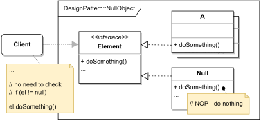

# NULL OBJECT

#### GENERAL

**Behavioral** design pattern that tells us to implement a "nothing object" that effectively does nothing and can act
as a placeholder for real objects of some class hierarchy.

#### USAGE

This pattern is most commonly used to implement NOP behaviour and logically empty values (zero, empty string, ...) so
when we work with objects from some class hierarchy we don't have to constantly check whether we're working with an
actual object (if actual object doesn't exist we just provide the null version).

#### STRUCTURE

TL;DR behaviour - we have a hierarchy of main objects (**A, ...**) who follow the exact same interface (**Element**).
Now so the client doesn't have to always check whether he's working with real objects (**A, ...**) we create a new 
variant (**Null**) whose implementation effectively does nothing. This null variation can them be substituted to the
client as a real object and if executes one of its methods nothing will happen.

#### EXAMPLE

Let's imagine following situation in the context of aforementioned [prototype](../README.md#prototype). The **modeler**
is responsible for somehow evaluating the scraped data and performing some calculations to acquire final score.
Now let's assume these calculations work with predefined set of certain variables (we have a class hierarchy of variables)
and normally we'd have to check that any given variable actually exists (i.e. is not nullptr).

#### SOLUTION

One way to avoid the constant checking is to use a **Null Object**. We just extend the existing set of variable classes
with *NullVariable* which will have logically empty value (in our case zero as the simulated calculation works with numbers
and pretty much just adds the variables together).

Dummy implementation of this [example/solution](src) and [how to use it](main.cpp) is part of this directory.

#### SUMMARY

The main issue to watch out for is that, despite appearances, this approach does not completely rule out memory leaks
or null pointer exceptions. It only eliminates the necessity for null pointer checks from the anticipated logic flow 
of the application.
