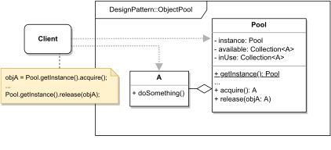

# OBJECT POOL

#### GENERAL

**Creational** design pattern that caches some expensive reusable objects to avoid their frequent
creation and destruction.

#### USAGE

This pattern is mostly used with connections to various services. More generally any situation, where
the cost of initialization of some reusable class is extremely high and the rate of instantiation is 
rapid, is a good place for "pooling".

#### STRUCTURE

TL;DR behaviour - there are two main entities and that's reusable objects (**A**) and the **pool**.
The **pool** has a set of available objects (**A**) that can be borrowed by some clients when it's
not ideal for them to create these objects (**A**) directly. The client will ask the **pool**
to lend them one of the objects, and after he's done with it, he will return it, so it can be borrowed
again by a different client.

NOTE: the **pool** can have predefined number of available objects, or it can dynamically grow/shrink
to avoid unavailability. Also, **pools** are usually implemented as [singletons](Singleton) so that
all managed objects are "under the same roof" and follow coherent policies.

#### EXAMPLE

Let's imagine following situation in the context of aforementioned [prototype](../README.md#prototype). The **scraper**
which is responsible for acquiring data from the web (i.e. running several web crawlers), should also backup every website (i.e. HTML)
it downloads to an external DWH (data warehouse). The DWH is shared for all apps in the company and runs in multiple
instances, so it can accommodate the enormous data flow. Now each instance runs on its own server, and it doesn't really
matter which one the **scraper** uses, it's only important that it backups all the data somewhere.

#### SOLUTION

One way to meet the set criteria is to use an **Object Pool**. If we think about, because there are several DWH servers
the **scraper** can use, and the choice of which one doesn't really matter, instead of creating new connection every 
time backup happens, there can just be pool of connections to each server that just lends them for the duration of
the backup.

Dummy implementation of this [example/solution](src) and [how to use it](main.cpp) is part of this directory.

#### SUMMARY

Main benefit of this solution is that it fully takes advantage of the multiple available servers so the app itself doesn't
create any unnecessary bottlenecks. Also, individual web crawlers that trigger the backup don't have to contain any logic
associated with choosing which connection to use, they just ask the **pool** to lend them one that is available at the moment.
