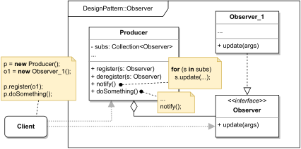

# OBSERVER

#### GENERAL

**Behavioral** GoF design pattern that enables us to notify a collection of objects about changes made to a different 
central entity. 

#### USAGE

This pattern basically mimics publish/subscribe paradigm. Best used when we have a logical **"producer"** which generates
some content and multiple **subscribers** that want to be actively notified, so they can somehow react.

#### STRUCTURE

TL;DR behaviour - there is a central object (**Producer**) that produces some content/events. This object has a list
of references to other objects (**Observer_1, Observer_2, ...**) which subscribe to being notified when the **producer**
makes some changes. These **subscribers** (**Observer_1, Observer_2, ...**) can then be registered/deregistered dynamically
during runtime.

#### EXAMPLE

Let's imagine following situation in the context of aforementioned [prototype](../README.md#prototype). The **scraper**
which is responsible for acquiring data from the web (i.e. running several web crawlers), receives scraping requests
through Kafka pipeline (topic) and upon their receival triggers multiple web crawlers for various sources (e.g. Google,
Facebook, ...). 

#### SOLUTION

One way to implement the mentioned example is to use an **Observer**. Instead of manually triggering individual web 
crawlers we can make KafkaConsumer class which will act as a **producer** and upon receiving scraper request will
notify all registered crawlers (**observers**) to begin their crawling process.

Dummy implementation of this [example/solution](src) and [how to use it](main.cpp) is part of this directory.

#### SUMMARY

The ability to dynamically change the pool of subscribers and quickly add new ones is a major benefit of this design
pattern.

The only slightly negative aspect is that individual subscribers don't receive notifications simultaneously, and in 
rare circumstances, there may be a large delay between the first and the last.
