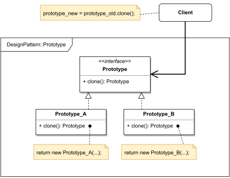

# Prototype

#### GENERAL

[TODO]

#### USAGE

[TODO]

#### STRUCTURE

TL;DR behaviour - [TODO]

#### EXAMPLE

Let's imagine following situation in the context of the aforementioned [prototype](../README.md#prototype). [TODO]

#### SOLUTION

[TODO]

Dummy implementation of this [example/solution](src) and [how to use it](main.cpp) is part of this directory.

#### SUMMARY

[TODO]
