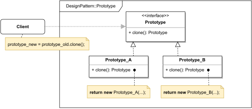

# PROTOTYPE

#### GENERAL

**Creational** GoF design pattern that allows us easily clone existing objects disregarding their concrete types.

#### USAGE

Generally this pattern is used in situations when it's desired to make some code completely independent of concrete
classes (usually some third-party objects). It can also be used to reduce duplicate code of setting up some complex
objects by cloning already existing instance and just changing whats needed.

#### STRUCTURE

TL;DR behaviour - there is a common interface for all cloneable objects (**Prototype**) which most importantly defines
cloning method ( **clone()** ) that returns the type **Prototype**. This method is then overridden in individual 
subclasses where the implementation creates and returns new object of their respective types (i.e. **Prototype_A, 
Prototype_B, ...**). Clients can than just work with **Prototype** interfaces and thanks to [dynamic dyspatch](https://en.wikipedia.org/wiki/Dynamic_dispatch)
always clone concrete types of objects.

#### EXAMPLE

Let's imagine following situation in the context of the aforementioned [prototype](../README.md#prototype). The **modeler**
works with set of classes representing various variables used in computations and just to make our lives a little easier
we'd like for them to cloneable (so rest of the **modeler's** code doesn't have to be tightly coupled with individual
types of variables).

#### SOLUTION

This example can be perfectly designed using **Prototype** by just creating shared interfaces for all variables with
a cloning method which will be later overridden in specific classes.

Dummy implementation of this [example/solution](src) and [how to use it](main.cpp) is part of this directory.

#### SUMMARY

This pattern has several great aspects like decoupling object copying from their types, providing more convenient way
to create complex objects and even possible reducing redundant code.

Only tricky problem that might occur when implementing this pattern is if we have objects with circular references -
solving that might be a bit of a challenge.
