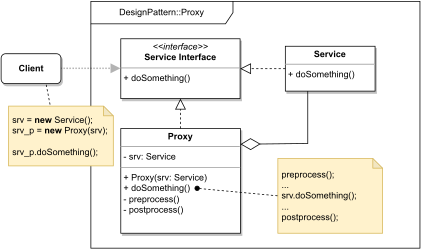

# PROXY

#### GENERAL

**Structural** GoF design pattern that allows us to provide a substitute for an object. The proxy object than does 
some pre/post-processing on methods of the original object.

#### USAGE

There is a wide variety of use cases - mostly proxies are used for authentication/authorization, result caching or
[lazy initialization](../LazyLoad).

#### STRUCTURE

TL;DR behaviour - there is an object which provides some functionality (**Service**) and to create a substitutional proxy
object, we just create a new class with the same interface (**Proxy**) that also has a reference to the original object.
All methods defined by the interface (**Service Interface**) are in the **Proxy** re-implemented to invoke the original
**Service** plus they can do some pre/post-processing.

#### EXAMPLE

Let's imagine following situation in the context of aforementioned [prototype](../README.md#prototype). The **scraper**
which is responsible for acquiring data from the web (i.e. running several web crawlers). Let's also assume that the
crawlers are provide by third-party library, and now we would like to extend their functionality (with blacklisting
certain URLs) with minimal changes to the existing code.

#### SOLUTION

One way to meet the set criteria is to use a **Proxy**. Pretty much we just create a new class which wraps around
the original crawler and before invoking his methods we check the requested URL against set of blacklisted patterns.

Dummy implementation of this [example/solution](src) and [how to use it](main.cpp) is part of this directory.

#### SUMMARY

Only thing to lookout for is that heavy pre/post-processing in proxy object can cause performance drop. Other than that
proxies are great for wide variety of things especially for modifying already existing pieces of code.
