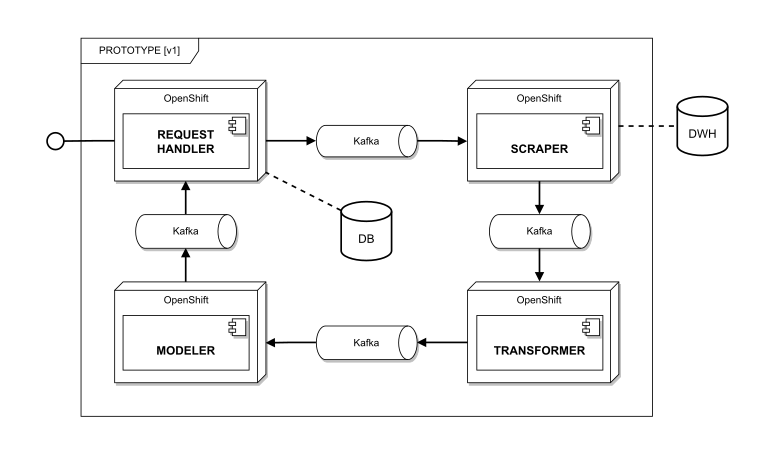

# DESIGN PATTERNS

This project aspires to educate junior developers in one fairly useful portion of application design, i.e. 
**design patterns**. It describes a context of fictional software [prototype](#prototype) within which individual 
patterns are explained. All examples then stand completely independent of each other but still reflect particular 
parts of the prototype. 

**CREATIONAL**
- [Abstract Factory](./AbstractFactory)
- [Builder](./Builder)
- [Factory Method](./FactoryMethod)
- [Lazy Load](./LazyLoad)
- [Object Pool](./ObjectPool)
- [Singleton](./Singleton)

**STRUCTURAL**
- [Adapter](./Adapter)
- [Decorator](./Decorator)
- [Facade](./Facade)
- [Flyweight](./Flyweight)
- [Mock Object](./MockObject)
- [Proxy](./Proxy)

**BEHAVIORAL**
- [Chain of Responsibility](./ChainOfResponsibility)
- [Command](./Command)
- [Iterator](./Iterator)
- [Mediator](./Mediator)
- [Memento](./Memento)
- [Observer](./Observer)

**CONCURRENT**
- ... 

---

# PROTOTYPE

#### BACKSTORY

Let's imagine there is an unnamed bank. Main purpose of any bank is to give out loans. But if you think about it, banks
can't actually hand out money at random. They need the people to repay them, otherwise they'd go out of business pretty
damn fast. In this day and age, the biggest banks use devious apps to acquire public information about potential clients, 
which are then used as indicators of ones repayment capacity.

#### GENERAL

Our prototype shall be an app, which is a part of a so-called "scoring process", that is triggered with each loan request.
Main purpose of this app will be scraping client's public data and based on them calculating a score (i.e. probability), 
that exhibits client's repayment ability.

NOTE: In real-world examples, such a score would be only one of dozens different indicators, and thanks to its nature 
and reliance on public information, it wouldn't really hold such a high importance in the grand scheme of things.

### ARCHITECTURE

The prototype is designed using microservice architecture mainly 'cause of its extremely high fault tolerance and 
exceptionally fast DRs (Disaster Recovery). Besides all that, this architecture is also highly scalable and excels in 
"on the fly" version releases with almost zero downtime. 

There are 4 main services:

- **REQUEST HANDLER** is a service responsible for handling communication with other systems (exposes API for requests)
- **SCRAPER** is a service responsible for crawling through a set of websites and collecting relevant info about given client
- **TRANSFORMER** is a service responsible for going through the scraped data and transforming them into numerical values
- **MODELER** is a service responsible for fitting the transformed data into some statistical model and running calculations

Besides these services, the app has an internal **database** used for storing final results and is connected to an 
external **data warehouse** where it logs every last piece of scraped information for audit purposes.

### DATA FLOW

In the beginning **request handler** accepts new scoring request and checks the internal DB for previously cached results.
If it finds a relevant entry than it just returns it, otherwise it passes the request along to the **scraper** and waits.
When the request reaches the **scraper**, it starts collecting various information from the web, which is then sent to
the **transformer**. The **transformer** then takes the scraped data and assigns individual data points certain numerical
values. Lastly, the transformed data are passed to the **modeler**, which plugs it into a particular statistical model 
and calculates a final score. This singular value is then returned to the **request handler**, who stores it in the 
internal database and returns it to the system which originally requested it.

### THIRD-PARTY COMPONENTS 

Following platforms are merely used as examples and can be swapped out for others with analogical functionality.

- **OpenShift** Container Platform is RedHat's on-premise cloud for hosting application, built around Linux containers orchestrated by Kubernetes.
- **Kafka** is a distributed event streaming platform by Apache, used mainly as a high-performance data pipeline.
