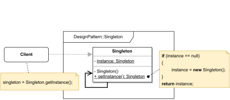

# Singleton

#### GENERAL

**Creational** GoF design pattern that lets you ensure only one instance of given class will exist at any point in time 
during application's runtime.

#### USAGE

Main use case is pretty self-explanatory - simply put there's a need for having only one globally accessible instance
of some class. Although usage of this pattern should be carefully wighted as it introduces often times unnecessary
global state which is by its nature in conflict with more than few principles of good OO code.

#### STRUCTURE

TL;DR behaviour - basically the class that's supposed to be a **Singleton** (i.e. have only one instance) firstly privatizes
its constructor and all alternative construction mechanisms, then defines private static instance variable and lastly
exposes public static method used for creating/accessing the instance. The **getInstance()** method is where most of 
the magic happens because it acts as a constructor that's also responsible for the "uniqueness control".

NOTE: depending on your needs and programming language you use, you have to be careful when implementing this pattern
to really ensure there will always be only one instance - most common problem is forgetting multithreading (but also
serialization/deserialization, reflexion, ...)

#### EXAMPLE

Let's imagine following situation in the context of aforementioned [prototype](../README.md#prototype). The **request handler**
saves processed requests in database for caching purposes (calculated score is valid for certain amount of time).
This DB is provided by another dept. responsible for all DBs hosted on company's internal server and because
they have limited computing power, they restrict the number of active connections to only one per application.

#### SOLUTION

One way to meet the set criteria is to use a **Singleton**. Basically, we just have to ensure that at any given time the
**request handler** will have only one active connection to the DB, which is pretty much exactly what the **Singleton**
pattern does.

Dummy implementation of this [example/solution](src) and [how to use it](main.cpp) is part of this directory.

#### SUMMARY

Best part about this approach is that it provides one global access point that can be reused throughout the whole
app without any additional need for uniqueness checks. Everything is handled internally by the object.

Worst thing is that **Singleton** violates several OO principles, complicates unit testing and might mask otherwise 
easily visible shortcomings in application's design.
