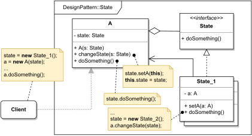

# STATE

#### GENERAL

**Behavioral** GoF design pattern that lets us alter object's behaviour based on his internal state.

#### USAGE

Generally used in situation when an object has to behave differently depending on his internals (i.e. state) which can
have several variations. Common use case is a class that mimics some state machine.

#### STRUCTURE

TL;DR behaviour - there is an object (**A**) whose behaviour changes depending on his state. The state specific behaviour
is then implemented in a helper classes (**State_1, ...**) to which the original object (**A**) has reference, so it can
invoke their methods. The state objects usually also have a reference to their owner (**A**) so they can trigger state
change on their own.

#### EXAMPLE

Let's imagine following situation in the context of aforementioned [prototype](../README.md#prototype). The **req. handler**
which is responsible for handling incoming requests has to handle dozens of client systems which often ask for the exact
same calculation at the same time. In other words we don't want to trigger the same process ten times simultaneously so
there is no unnecessary work done.

#### SOLUTION

One way to solve this example is to use a **State** pattern. Basically the **req. handler** will have a request class
to keep track of individual process which will have different internal states (created, in-progress, finished, error, ...)
that will modify its business logic (i.e. created request will be triggering the whole scoring process, finished request
will be retrieving final result, ...).

Dummy implementation of this [example/solution](src) and [how to use it](main.cpp) is part of this directory.

#### SUMMARY

The nice thing about this design is that it eliminates the need for futile conditional statements that would 
otherwise be necessary in multiple places.

The only drawback, like with many patterns, is that it actually only makes sense in larger cases when there are more 
potential states.