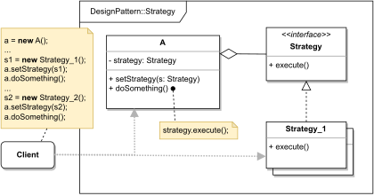

# STRATEGY

#### GENERAL

**Behavioral** GoF design pattern that allows us to design a family of fully interchangeable algorithms.

#### USAGE

Very straightforward usage - when we have various variations of one logically same algorithm, and we want to be able
to switch them during runtime. Also, it can remove redundant conditionals and switches.

#### STRUCTURE

TL;DR behaviour - there is a main class (**A**) which triggers some functionality (i.e. algorithms) and instead of her
implementing the algorithms directly, we put them into a separate class (**Strategy_1, ...**), so they can be 
easily interchanged even during runtime.

#### EXAMPLE

Let's imagine following situation in the context of aforementioned [prototype](../README.md#prototype). The **modeler**
which is responsible for somehow evaluating the scraped data and performing some calculations to acquire final score.
Now let's assume we have different variations of the algorithm that does the actual calculation, and we'd like for these
variations to be switchable during runtime (e.g. for different types of clients different algorithms - i.e. private client,
SME, MSE, Corporate client, ...).

#### SOLUTION

One way to solve this example is to use a **Strategy**. We pretty much just put the different variations into separate
classes and in some core of the **modeler** have a reference to the one that's being used in given case.

Dummy implementation of this [example/solution](src) and [how to use it](main.cpp) is part of this directory.

#### SUMMARY

This pattern provides several advantages such as isolating details of the algorithm, possibility to swap individual
algorithms during runtime and more. The only thing is that it becomes less and less popular as modern programming
languages have functional type support thanks to which strategy objects can be basically replaced by a set of 
anonymous functions.
