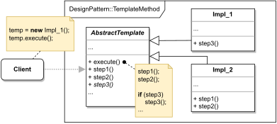

# TEMPLATE METHOD

#### GENERAL

**Behavioral** GoF design pattern that allows us to specify an algorithm's overall structure using individual steps, 
which may then be changed without altering the overall structure in subclasses.

#### USAGE

Generally this pattern is used in situation when we want to allow modifications to only certain steps of some algorithm
or have several almost identical algorithms with only minor differences in some steps. In practise, it's very common 
in frameworks.

#### STRUCTURE

TL;DR behaviour - there is a parent class (**AbstractTemplate**) which implements the overall structure of some algorithm
and defines individual steps that may be overridden. Then there are subclasses (**Impl_1, Impl_2, ...**) which all
execute the same steps in the same order (as defined in *execute* method in parent class), but may re-implement 
behaviour of some of those steps.

#### EXAMPLE

Let's imagine following situation in the context of aforementioned [prototype](../README.md#prototype). The **modeler**
 is responsible for somehow evaluating the scraped data and performing some calculations to acquire final score.
Now let's assume we have different variations of the algorithm that does the actual calculation (e.g. for different
types of clients - i.e. private clients, corporate clients ...), but all of these variations follow same steps that
may slightly vary in their behaviour (e.g. one of the first steps will be filtering the data and process will be
different for corporate clients opposed to private ones).

#### SOLUTION

One way to nicely solve this example is to use a **Template Method**. Firstly we define the overall structure 
(i.e. individual steps and theirs sequence) of all calculation algorithms in the parent class. Afterwards we create 
corresponding subclasses based on client's type. And lastly in those subclasses we'll override steps that need
to be overridden.

Dummy implementation of this [example/solution](src) and [how to use it](main.cpp) is part of this directory.

#### SUMMARY

Main advantages are that for one we can control which steps of the algorithm can be re-implemented and also if the 
concrete algorithm variations share large number of steps we avoid writing a lot of redundant code.

One of the drawbacks is that future subclasses can be limited by the original skeleton. Another biggie is that
this pattern can easily violate [the Liskov Substitution Principle](https://en.wikipedia.org/wiki/Liskov_substitution_principle)
by overriding (and suppressing) default step implementation.
