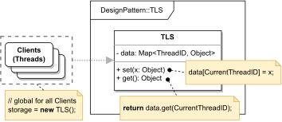

# THREAD LOCAL STORAGE (TLS)

#### GENERAL

**Concurrent** design pattern that allows us to simulate globally accessible storage while in reality each thread
will have its own copy (i.e. memory space).

#### USAGE

TLSs aren't very common sight in regular applications as they are more of a low-level mechanism which is used at a
compiler/kernel level. But still there are some rare occasion in which they may be of use, generally when we have a
variable/object/collection that logically global but in practise has to be thread-specific. TLSs can be used for example
for low overhead logging/tracing or special caches.

#### STRUCTURE

TL;DR behaviour - the object that implements **TLS** usually stores the data in special collection which has divided
into multiple sections, where each section assigned to a concrete thread via its thread-specific ID.

NOTE: in modern programming languages you'll hardly see such implementation as most of them already support TLS to some
degree (e.g. C++11 introduced *thread_local* keyword which basically mediates TLS functionality)

#### EXAMPLE

Let's imagine following situation in the context of aforementioned [prototype](../README.md#prototype). We implement
our own logger and because parts of the prototype use multithreaded design (e.g. **Scraper**), the logger has to 
be ready for use in concurrent environments.

#### SOLUTION

Now once again there are many ways to implement the mentioned example, but we'd like to avoid complex and moreover 
overhead-heavy locking mechanisms and keep one globally setup logger object. We can achieve these goals via **TLS**.
More specifically the logger object will have its own **TLS**-style buffer which will appear like a global variable, 
but in reality will be specific for each thread. 

This approach allows us to do just one setup of the global logger object which can then be used by multiple threads 
without any synchronization overhead. Only disadvantage is that if needed, merging of individual buffers with log 
messages would require some additional logic (e.g. timestamping and merge+sort at the end).

Dummy implementation of this [example/solution](src) and [how to use it](main.cpp) is part of this directory.

#### SUMMARY

This pattern is somewhat controversial because it doesn't have such a high applicability and most of the time it's
easier (and better) to just make the **TLS** fully thread local and forget about the global access point.
