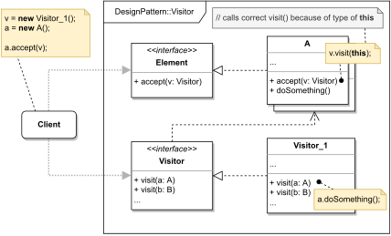

# VISITOR

#### GENERAL

**Behavioral** GoF design pattern that allows us to separate algorithms from objects they operate on (i.e. functionality
of some object won't be incorporated using his methods but rather somewhere else).

#### USAGE

This pattern isn't all that popular thanks to its high complexity and very limited applicability. Most commonly it's
used for introducing some auxiliary behaviour to a set of specific classes of some hierarchy (e.g. implementing exporting
options to different formats to a set of existing classes).

#### STRUCTURE

TL;DR behaviour - there are two main components to this pattern and that's individual **Elements** (**A, B, ..**) and 
various **Visitors** (**Visitor_1, Visitor_2, ...**). Each visitor defines set of visiting methods that implement some
behaviour (i.e. algorithm) that uses certain elements (**A, B, ...**). This behaviour (i.e. visitor's method) is then 
invoked through an "accept method" implemented on each of the elements.

NOTE: that if we follow same implementation as displayed on the diagram, it's extremely important that
each element (**A, B, ...*) overrides the "accept method" - because of a type of **this** used for
invoking visitor's methods (more in-depth info: [double dispatch](https://refactoring.guru/pages/design-patterns/visitor-double-dispatch))

#### EXAMPLE

Let's imagine following situation in the context of aforementioned [prototype](../README.md#prototype). In the [composite](../Composite)
pattern we introduced an example which included our own DataProfile structure which is used to store the transformed
scraped client's data. Now let's imagine this structure is a tree-like object (i.e. sections with sections ... of data)
and we'd like to implement exporting functionality with the least amount of changes to the existing code.

#### SOLUTION

One way to implement desired behaviour is to use a **Visitor**. We just extend existing classes with the "accept method"
and then create several visitors on a per-export-format basis which will implement the actual exporting functionality.

Dummy implementation of this [example/solution](src) and [how to use it](main.cpp) is part of this directory.

#### SUMMARY

Positive aspect of this pattern is that after the initial setup, introducing new behaviour means just implementing new
visitor which is very easy. Also thanks to visitors being separate objects, they can be "stateful" and exchange info
in between visits of different elements, which might be hard to achieve with different approaches.

On the other hand it's highly unlikely you'll ever use this pattern, but if you do the main obstacle you might come 
in contact with is not having necessary access to attributes/methods of individual elements. Also adding new classes
to the set of visitable elements requires extension of all existing visitors.
